# BDR Design System

You are building UI for **BDR**. Dark-themed, cool palette, sans-serif typography (Public Sans), compact density on a 4px grid, expressive motion.

## Visual Reference

**IMPORTANT**: Study ALL screenshots below before writing any UI. Match colors, typography, spacing, layout, and motion exactly as shown.

### Homepage

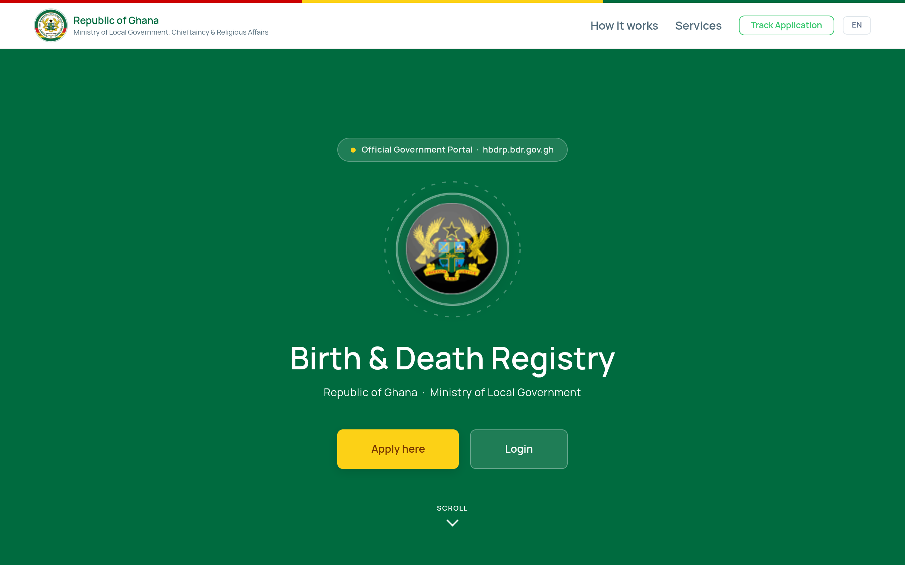

### Scroll Journey (Cinematic Visual States)

> These screenshots capture the website at different scroll depths. The design changes dramatically as you scroll — each frame shows a different cinematic state. Replicate these exact visual transitions.

#### 0% — Hero / Above the fold

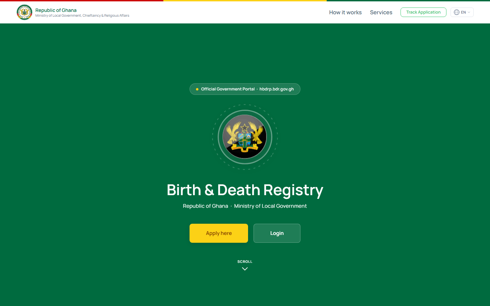

#### 17% — Mid-page at 17% scroll


#### 33% — Mid-page at 33% scroll

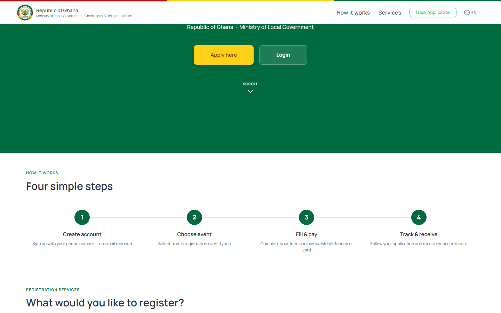

#### 50% — Mid-page at 50% scroll

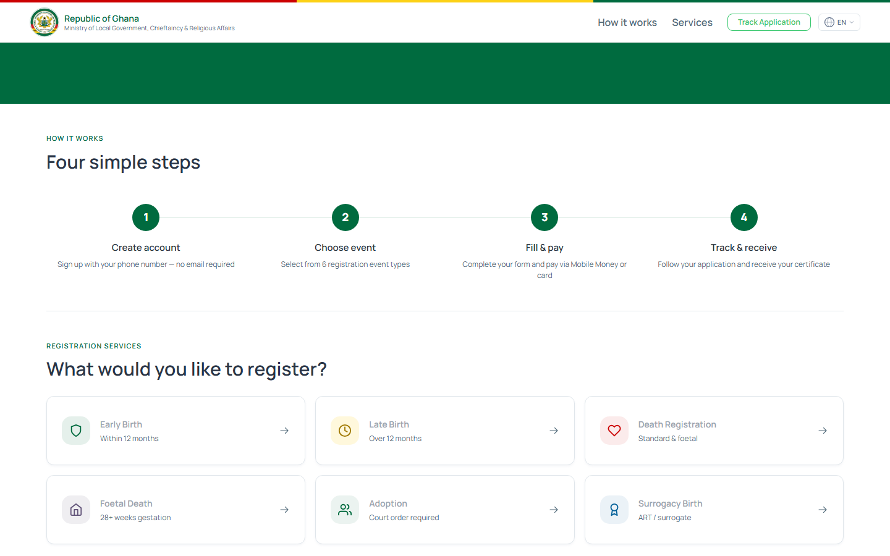

#### 67% — Mid-page at 67% scroll

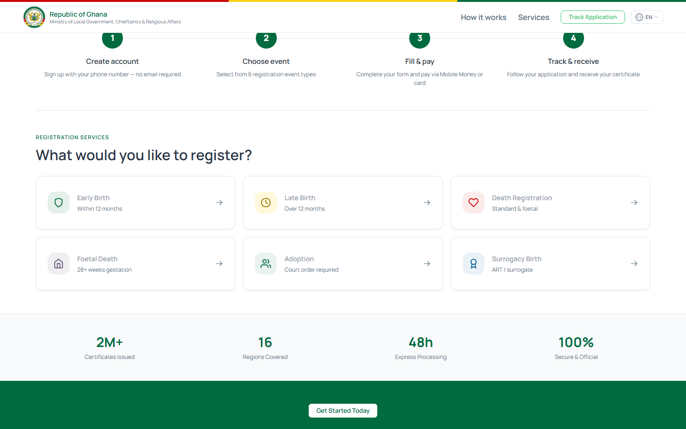

#### 83% — Mid-page at 83% scroll


#### 100% — Footer / End of page

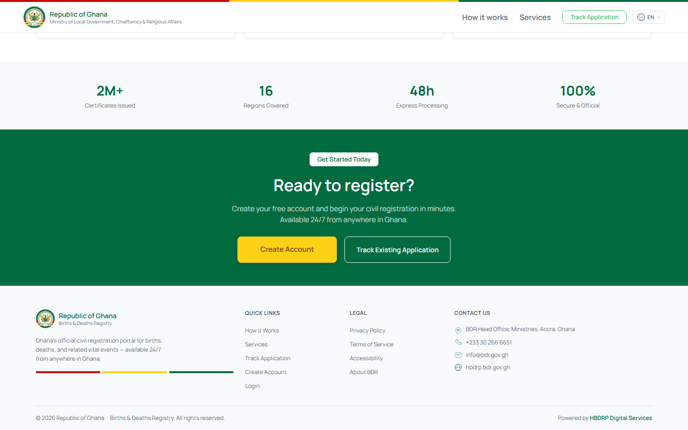

> Read `references/DESIGN.md` for full token details. Read `references/ANIMATIONS.md` for motion specs. Read `references/LAYOUT.md` for layout structure. Read `references/COMPONENTS.md` for component patterns.

## Ultra Reference Files

This package includes extended documentation. **Read these files before implementing:**

| File | Contents |
|------|----------|
| `references/DESIGN.md` | Full design system tokens, colors, typography, spacing |
| `references/VISUAL_GUIDE.md` | **START HERE** — Master visual guide with all screenshots embedded |
| `references/ANIMATIONS.md` | CSS keyframes, scroll triggers, motion library stack, video specs |
| `references/LAYOUT.md` | Flex/grid containers, page structure, spacing relationships |
| `references/COMPONENTS.md` | DOM component patterns, HTML structure, class fingerprints |
| `references/INTERACTIONS.md` | Hover/focus states with before/after style diffs |
| `screens/scroll/` | 7 scroll journey screenshots showing cinematic states |

### Animation Stack Detected

- **Web Animations API (8 active)** — animation

## Design Philosophy

- **Layered depth** — use shadow tokens to create a sense of physical layering. Each elevation level has a specific shadow.
- **Gradient accents** — gradients are used thoughtfully for emphasis, not decoration.
- **Type pairing** — Public Sans for body/UI text, Manrope for headings/display. Never introduce a third typeface.
- **compact density** — 4px base grid. Every dimension is a multiple of 4.
- **cool palette** — the color temperature runs cool, matching the sans-serif typography.
- **Restrained accent** — `#635bff` is the only pop of color. Used exclusively for CTAs, links, focus rings, and active states.
- **Expressive motion** — animations are an integral part of the experience. Use spring physics and layout animations.

## Color System

### Core Palette

| Role | Token | Hex | Use |
|------|-------|-----|-----|
| Background | `--background` | `#006b3f` | Page/app background |
| Surface | `--surface` | `#000000` | Cards, panels, modals |
| Text Primary | `--text-primary` | `#ffffff` | Headings, body text |
| Text Muted | `--text-muted` | `#98a4ae` | Captions, placeholders |
| Accent | `--accent` | `#635bff` | CTAs, links, focus rings |
| Border | `--border` | `#29343d` | Dividers, card borders |

### Status Colors

| Status | Hex | Use |
|--------|-----|-----|
| Success | `#005233` | Confirmations, positive trends |
| Warning | `#fcd116` | Caution states, pending items |
| Danger | `#cc0001` | Errors, destructive actions |

### Extended Palette

- **bs-muted:** `#526b7a` — Secondary text, placeholder text
- **bs-accordion-btn-color:** `#eaeff4` — Light surface or highlight color
- `#111c2d`
- **bs-table-border-color:** `#3b5166`
- `#64748b`
- `#7a3800`
- **bs-warning:** `#f8c20a` — Warning banners, caution states
- **bs-btn-border-color:** `#0a2540`

### CSS Variable Tokens

```css
--bs-card-subtitle-color: rgba(255,255,255,0.6);
--bs-secondary-color: rgba(255,255,255,0.6);
--bs-card-title-color: rgba(255,255,255,0.85);
--bs-card-subtitle-color: rgba(255,255,255,0.6);
--bs-card-bg: #1a2537;
--bs-card-box-shadow: none;
--bs-table-border-color: #313e54;
--bs-accordion-border-color: #333f55;
--bs-primary: #635BFF;
--bs-primary-rgb: 99,91,255;
--bs-secondary: #16CDC7;
--bs-secondary-rgb: 22,205,199;
--bs-btn-border-color: #635BFF;
--bs-btn-hover-border-color: #5249fe;
--bs-btn-border-color: #16CDC7;
--bs-btn-hover-border-color: #1cc3bd;
--bs-primary: #0074ba;
--bs-primary-rgb: 0,116,186;
--bs-light-primary: rgba(0,116,186,0.1);
--bs-primary-bg-subtle: rgba(0,116,186,0.1);
```

## Typography

### Font Stack

- **Public Sans** — Heading 1, Heading 2, Heading 3
- **Manrope** — Body, Caption
- **SFMono-Regular** — Code

### Font Sources

```css
@font-face {
  font-family: "Manrope";
  src: url("fonts/Manrope-Bold.ttf") format("truetype");
  font-weight: 700;
}
@font-face {
  font-family: "Manrope";
  src: url("fonts/Manrope-Regular.ttf") format("truetype");
  font-weight: 400;
}
@font-face {
  font-family: "Public Sans";
  src: url("fonts/PublicSans-Bold.ttf") format("truetype");
  font-weight: 700;
}
@font-face {
  font-family: "Public Sans";
  src: url("fonts/PublicSans-Regular.ttf") format("truetype");
  font-weight: 400;
}
```

### Type Scale

| Role | Family | Size | Weight |
|------|--------|------|--------|
| Heading 1 | Public Sans | 5rem | 700 |
| Heading 2 | Public Sans | 4.5rem | 700 |
| Heading 3 | Public Sans | 4rem | 700 |
| Body | Manrope | 13px | 400 |
| Caption | Manrope | 12px | 400 |
| Code | SFMono-Regular | 14px | 400 |

### Typography Rules

- Body/UI: **Public Sans**, Headings: **Manrope** — these are the only display fonts
- Max 3-4 font sizes per screen
- Headings: weight 600-700, body: weight 400
- Use color and opacity for text hierarchy, not additional font sizes
- Line height: 1.5 for body, 1.2 for headings

## Spacing & Layout

### Base Grid: 4px

Every dimension (margin, padding, gap, width, height) must be a multiple of **4px**.

### Spacing Scale

`2, 4, 6, 8, 10, 12, 14, 16, 18, 20, 22, 24` px

### Spacing as Meaning

| Spacing | Use |
|---------|-----|
| 4-8px | Tight: related items (icon + label, avatar + name) |
| 12-16px | Medium: between groups within a section |
| 24-32px | Wide: between distinct sections |
| 48px+ | Vast: major page section breaks |

### Border Radius

Scale: `.25em, .25rem, .375rem, 1rem, 2em, 8px, inherit, .2rem, 2px, 3px, 4px, 5px, 6px, 7px, 10px, 12px, 14px, 15%, 15px, 16px, 20px, 23px, 24px, 50px, 99px, 100%, 999px`
Default: `7px`

### Container

Max-width: `1024px`, centered with auto margins.

### Breakpoints

| Name | Value |
|------|-------|
| xs | 241px |
| xs | 360px |
| xs | 400px |
| xs | 480px |
| sm | 481px |
| sm | 575px |
| sm | 575.98px |
| sm | 576px |
| sm | 600px |
| sm | 640px |
| md | 767.98px |
| md | 768px |
| lg | 991px |
| lg | 991.98px |
| lg | 992px |
| lg | 1024px |
| xl | 1100px |
| xl | 1199px |
| xl | 1200px |
| 2xl | 1299.98px |
| 2xl | 1300px |
| 2xl | 1399.98px |
| 2xl | 1400px |
| 2xl | 1500px |

Mobile-first: design for small screens, layer on responsive overrides.

## Component Patterns

### Card

```css
.card {
  background: #000000;
  border: 1px solid #29343d;
  border-radius: 7px;
  padding: 16px;
  box-shadow: var(--bs-box-shadow-sm);
}
```

```html
<div class="card">
  <h3>Card Title</h3>
  <p>Card content goes here.</p>
</div>
```

### Button

```css
/* Primary */
.btn-primary {
  background: #635bff;
  color: #ffffff;
  border-radius: 7px;
  padding: 8px 16px;
  font-weight: 500;
  transition: opacity 150ms ease;
}
.btn-primary:hover { opacity: 0.9; }

/* Ghost */
.btn-ghost {
  background: transparent;
  border: 1px solid #29343d;
  color: #ffffff;
  border-radius: 7px;
  padding: 8px 16px;
}
```

```html
<button class="btn-primary">Get Started</button>
<button class="btn-ghost">Learn More</button>
```

### Input

```css
.input {
  background: #006b3f;
  border: 1px solid #29343d;
  border-radius: 7px;
  padding: 8px 12px;
  color: #ffffff;
  font-size: 14px;
}
.input:focus { border-color: #635bff; outline: none; }
```

```html
<input class="input" type="text" placeholder="Search..." />
```

### Badge / Chip

```css
.badge {
  display: inline-flex;
  align-items: center;
  padding: 4px 8px;
  border-radius: 9999px;
  font-size: 12px;
  font-weight: 500;
  background: #000000;
  color: #98a4ae;
}
```

```html
<span class="badge">New</span>
<span class="badge">Beta</span>
```

### Modal / Dialog

```css
.modal-backdrop { background: rgba(0, 0, 0, 0.6); }
.modal {
  background: #000000;
  border: 1px solid #29343d;
  border-radius: 999px;
  padding: 24px;
  max-width: 480px;
  width: 90vw;
  box-shadow: 0 17px 20px -8px rgba(77,91,236,.231372549);
}
```

```html
<div class="modal-backdrop">
  <div class="modal">
    <h2>Dialog Title</h2>
    <p>Dialog content.</p>
    <button class="btn-primary">Confirm</button>
    <button class="btn-ghost">Cancel</button>
  </div>
</div>
```

### Table

```css
.table { width: 100%; border-collapse: collapse; }
.table th {
  text-align: left;
  padding: 8px 12px;
  font-weight: 500;
  font-size: 12px;
  color: #98a4ae;
  text-transform: uppercase;
  letter-spacing: 0.05em;
  border-bottom: 1px solid #29343d;
}
.table td {
  padding: 12px;
  border-bottom: 1px solid #29343d;
}
```

```html
<table class="table">
  <thead><tr><th>Name</th><th>Status</th><th>Date</th></tr></thead>
  <tbody>
    <tr><td>Item One</td><td>Active</td><td>Jan 1</td></tr>
    <tr><td>Item Two</td><td>Pending</td><td>Jan 2</td></tr>
  </tbody>
</table>
```

### Navigation

```css
.nav {
  display: flex;
  align-items: center;
  gap: 8px;
  padding: 12px 16px;
  border-bottom: 1px solid #29343d;
}
.nav-link {
  color: #98a4ae;
  padding: 8px 12px;
  border-radius: 7px;
  transition: color 150ms;
}
.nav-link:hover { color: #ffffff; }
.nav-link.active { color: #635bff; }
```

```html
<nav class="nav">
  <a href="/" class="nav-link active">Home</a>
  <a href="/about" class="nav-link">About</a>
  <a href="/pricing" class="nav-link">Pricing</a>
  <button class="btn-primary" style="margin-left: auto">Get Started</button>
</nav>
```

## Animation & Motion

This project uses **expressive motion**. Animations are part of the design language.

### CSS Animations

- `progress-bar-stripes`
- `spinner-border`
- `spinner-grow`
- `placeholder-glow`
- `placeholder-wave`

### Motion Tokens

- **Duration scale:** `0ms`, `0s`, `.3s`, `50ms`, `100ms`, `120ms`, `150ms`, `180ms`, `200ms`, `250ms`, `300ms`, `350ms`, `400ms`, `500ms`, `600ms`, `880ms`, `1000ms`
- **Easing functions:** `ease-in-out`, `linear`, `ease`, `ease-out`, `ease-in`, `cubic-bezier(.4,0,.2,1)`, `cubic-bezier(.075,.82,.165,1)`, `cubic-bezier(.8,0,1,1)`, `cubic-bezier(0,0,.2,1)`, `cubic-bezier(.34,1.56,.64,1)`, `cubic-bezier(.22,1,.36,1)`
- **Animated properties:** `border-color`, `box-shadow`

### Motion Guidelines

- **Duration:** Use values from the duration scale above. Short (0ms) for micro-interactions, long (1000ms) for page transitions
- **Easing:** Use `ease-in-out` as the default easing curve
- **Direction:** Elements enter from bottom/right, exit to top/left
- **Reduced motion:** Always respect `prefers-reduced-motion` — disable animations when set

## Depth & Elevation

### Shadow Tokens

- Subtle: `0 0 0 1px #fff,0 0 0 .25rem rgba(99,91,255,.25)`
- Subtle: `0 0 0 2px #facc1566`
- Subtle: `0 0 0 1px #ffffff59`
- Subtle: `0 0 0 1px #fff6`
- Subtle: `inset 0 0 0 2px #006b3f26`
- Raised (cards, buttons): `var(--bs-box-shadow-sm)`

### Z-Index Scale

`0, 1, 2, 3, 4, 5, 9, 10, 40, 45, 50, 98, 99, 100, 200, 300, 999, 1000, 1020, 1030, 1040, 1050, 1055, 1060, 9999, 99999, 999999`

Use these exact values — never invent z-index values.

## Anti-Patterns (Never Do)

- **No blur effects** — no backdrop-blur, no filter: blur()
- **No zebra striping** — tables and lists use borders for separation
- **No invented colors** — every hex value must come from the palette above
- **No arbitrary spacing** — every dimension is a multiple of 4px
- **No extra fonts** — only Public Sans and Manrope and SFMono-Regular are allowed
- **No arbitrary border-radius** — use the scale: .25em, .25rem, .375rem, 1rem, 2em, 8px, .2rem, 2px, 3px, 4px
- **No opacity for disabled states** — use muted colors instead

## Workflow

1. **Read** `references/DESIGN.md` before writing any UI code
2. **Pick colors** from the Color System section — never invent new ones
3. **Set typography** — Public Sans, Manrope, SFMono-Regular only, using the type scale
4. **Build layout** on the 4px grid — check every margin, padding, gap
5. **Match components** to patterns above before creating new ones
6. **Apply elevation** — use shadow tokens
7. **Validate** — every value traces back to a design token. No magic numbers.

## Brand Spec

- **Favicon:** `https://bdr.npontutechnologies.com/images/favicon.png`
- **Site URL:** `https://bdr.npontutechnologies.com`
- **Brand color:** `#635bff`
- **Brand typeface:** Public Sans

## Quick Reference

```
Background:     #006b3f
Surface:        #000000
Text:           #ffffff / #98a4ae
Accent:         #635bff
Border:         #29343d
Font:           Public Sans
Spacing:        4px grid
Radius:         7px
Components:     0 detected
```

## When to Trigger

Activate this skill when:
- Creating new components, pages, or visual elements for BDR
- Writing CSS, Tailwind classes, styled-components, or inline styles
- Building page layouts, templates, or responsive designs
- Reviewing UI code for design consistency
- The user mentions "BDR" design, style, UI, or theme
- Generating mockups, wireframes, or visual prototypes

---

# Full Reference Files

> Every output file is embedded below. Claude has full design system context from /skills alone.

## Design System Tokens (DESIGN.md)

# BDR DESIGN.md

> Auto-generated design system — reverse-engineered via static analysis by skillui.
> Frameworks: None detected
> Colors: 20 · Fonts: 3 · Components: 0
> Icon library: not detected · State: not detected
> Primary theme: dark · Dark mode toggle: no · Motion: expressive

## Visual Reference

**Match this design exactly** — study colors, fonts, spacing, and component shapes before writing any UI code.


---

## 1. Visual Theme & Atmosphere

This is a **dark-themed** interface with a cool tone. Depth is expressed through layered shadows and subtle surface color variation. Typography pairs **Manrope** for display/headings with **Public Sans** for body text, creating clear visual hierarchy through type contrast. Spacing follows a **4px base grid** (compact density), with scale: 2, 4, 6, 8, 10, 12, 14, 16px. The accent color **#635bff** anchors interactive elements (buttons, links, focus rings). Motion is expressive — spring physics, layout animations, and staggered reveals are part of the visual language.

---

## 2. Color Palette & Roles

| Token | Hex | Role | Use |
|---|---|---|---|
| bs-primary | `#006b3f` | background | Page background, darkest surface |
| bs-emphasis-color | `#000000` | surface | Card and panel backgrounds |
| bs-card-bg | `#1a2537` | surface | Card and panel backgrounds |
| bs-heading-color | `#ffffff` | text-primary | Headings and body text |
| bs-body-color | `#98a4ae` | text-muted | Captions, placeholders, secondary info |
| bs-dark-text-emphasis | `#29343d` | border | Dividers, card borders, outlines |
| bs-primary | `#635bff` | accent | CTAs, links, focus rings, active states |
| danger | `#cc0001` | danger | Error states, destructive actions |
| success | `#005233` | success | Success states, positive indicators |
| warning | `#fcd116` | warning | Warning states, caution indicators |
| bs-accordion-btn-color | `#eaeff4` | info | Informational highlights |
| bs-muted | `#526b7a` | unknown | Palette color |
| unknown | `#111c2d` | unknown | Palette color |
| bs-table-border-color | `#3b5166` | unknown | Palette color |
| unknown | `#64748b` | unknown | Palette color |
| unknown | `#7a3800` | unknown | Palette color |
| bs-warning | `#f8c20a` | unknown | Palette color |
| bs-btn-border-color | `#0a2540` | unknown | Palette color |
| bs-border-color | `#e0e6eb` | unknown | Palette color |
| bdr-muted | `#7c8fac` | unknown | Palette color |

### CSS Variable Tokens

```css
--bs-card-subtitle-color: rgba(255,255,255,0.6);
--bs-secondary-color: rgba(255,255,255,0.6);
--bs-card-title-color: rgba(255,255,255,0.85);
--bs-card-subtitle-color: rgba(255,255,255,0.6);
--bs-card-bg: #1a2537;
--bs-card-box-shadow: none;
--bs-table-border-color: #313e54;
--bs-accordion-border-color: #333f55;
--bs-primary: #635BFF;
--bs-primary-rgb: 99,91,255;
--bs-secondary: #16CDC7;
--bs-secondary-rgb: 22,205,199;
--bs-btn-border-color: #635BFF;
--bs-btn-hover-border-color: #5249fe;
--bs-btn-border-color: #16CDC7;
--bs-btn-hover-border-color: #1cc3bd;
--bs-primary: #0074ba;
--bs-primary-rgb: 0,116,186;
--bs-light-primary: rgba(0,116,186,0.1);
--bs-primary-bg-subtle: rgba(0,116,186,0.1);
```


---

## 3. Typography Rules

**Font Stack:**
- **Public Sans** — Heading 1, Heading 2, Heading 3
- **Manrope** — Body, Caption
- **SFMono-Regular** — Code

**Font Sources:**

```css
@font-face {
  font-family: "Manrope";
  src: url("fonts/Manrope-Bold.ttf") format("truetype");
  font-weight: 700;
}
@font-face {
  font-family: "Manrope";
  src: url("fonts/Manrope-Regular.ttf") format("truetype");
  font-weight: 400;
}
@font-face {
  font-family: "Public Sans";
  src: url("fonts/PublicSans-Bold.ttf") format("truetype");
  font-weight: 700;
}
@font-face {
  font-family: "Public Sans";
  src: url("fonts/PublicSans-Regular.ttf") format("truetype");
  font-weight: 400;
}
```

| Role | Font | Size | Weight |
|---|---|---|---|
| Heading 1 | Public Sans | 5rem | 700 |
| Heading 2 | Public Sans | 4.5rem | 700 |
| Heading 3 | Public Sans | 4rem | 700 |
| Body | Manrope | 13px | 400 |
| Caption | Manrope | 12px | 400 |
| Code | SFMono-Regular | 14px | 400 |

**Typographic Rules:**
- Limit to 3 font families max per screen
- Use **Public Sans** for body/UI text, **Manrope** for display/headings
- Maintain consistent hierarchy: no more than 3-4 font sizes per screen
- Headings use bold (600-700), body uses regular (400)
- Line height: 1.5 for body text, 1.2 for headings
- Use color and opacity for secondary hierarchy, not additional font sizes


---

## 4. Component Stylings

No components detected. Scan `src/components/` or `components/` to populate this section.

---

## 5. Layout Principles

- **Base spacing unit:** 4px
- **Spacing scale:** 2, 4, 6, 8, 10, 12, 14, 16, 18, 20, 22, 24
- **Border radius:** .25em, .25rem, .375rem, 1rem, 2em, 8px, inherit, .2rem, 2px, 3px, 4px, 5px, 6px, 7px, 10px, 12px, 14px, 15%, 15px, 16px, 20px, 23px, 24px, 50px, 99px, 100%, 999px
- **Max content width:** 1024px

**Spacing as Meaning:**
| Spacing | Use |
|---|---|
| 4-8px | Tight: related items within a group |
| 12-16px | Medium: between groups |
| 24-32px | Wide: between sections |
| 48px+ | Vast: major section breaks |


---

## 6. Depth & Elevation

### Flat — subtle depth hints

- `0 0 0 1px #fff,0 0 0 .25rem rgba(99,91,255,.25)`
- `0 0 0 2px #facc1566`
- `0 0 0 1px #ffffff59`

### Raised — cards, buttons, interactive elements

- `var(--bs-box-shadow-sm)`
- `var(--bs-box-shadow-inset)`
- `var(--bs-box-shadow-inset),0 0 0 .25rem rgba(99,91,255,.25)`

### Floating — dropdowns, popovers, modals

- `0 17px 20px -8px rgba(77,91,236,.231372549)`
- `rgba(0,0,0,.05)0 9px 17.5px`
- `0 5px 10px rgba(0,0,0,.03)`

### Overlay — full-screen overlays, top-level dialogs

- `inset 0 0 0 9999px rgba(239,244,250,.2)`
- `inset 0 0 0 9999px var(--bs-table-bg-state,var(--bs-table-bg-type,var(--bs-table-accent-bg)))`
- `0 15px 30px rgba(0,0,0,.12)`

### Z-Index Scale

`0, 1, 2, 3, 4, 5, 9, 10, 40, 45, 50, 98, 99, 100, 200, 300, 999, 1000, 1020, 1030, 1040, 1050, 1055, 1060, 9999, 99999, 999999`


---

## 7. Animation & Motion

This project uses **expressive motion**. Animations are an integral part of the experience.

### CSS Animations

- `@keyframes progress-bar-stripes`
- `@keyframes spinner-border`
- `@keyframes spinner-grow`
- `@keyframes placeholder-glow`
- `@keyframes placeholder-wave`
- `@keyframes animation-dropdown-menu-move-up-scroll`
- `@keyframes animation-dropdown-menu-fade-in`
- `@keyframes menuDropdownShow`

### Motion Guidelines

- Duration: 150-300ms for micro-interactions, 300-500ms for page transitions
- Easing: `ease-out` for enters, `ease-in` for exits
- Always respect `prefers-reduced-motion`


---

## 8. Do's and Don'ts

### Do's

- Use `#635bff` for interactive elements (buttons, links, focus rings)
- Use `#006b3f` as the primary page background
- Pair **Public Sans** (body) with **Manrope** (display) — these are the only allowed fonts
- Follow the **4px** spacing grid for all margins, padding, and gaps
- Use the defined shadow tokens for elevation — see Section 6
- Use border-radius from the scale: .25em, .25rem, .375rem, 1rem, 2em

### Don'ts

- Don't introduce colors outside this palette — extend the design tokens first
- Don't introduce additional font families beyond Public Sans and Manrope and SFMono-Regular
- Don't use arbitrary spacing values — stick to multiples of 4px
- Don't create custom box-shadow values outside the system tokens
- Don't use arbitrary border-radius values — pick from the defined scale
- Don't use backdrop-blur or blur effects

### Anti-Patterns (detected from codebase)

- No blur or backdrop-blur effects
- No zebra striping on tables/lists


---

## 9. Responsive Behavior

| Name | Value | Source |
|---|---|---|
| xs | 241px | css |
| xs | 360px | css |
| xs | 400px | css |
| xs | 480px | css |
| sm | 481px | css |
| sm | 575px | css |
| sm | 575.98px | css |
| sm | 576px | css |
| sm | 600px | css |
| sm | 640px | css |
| md | 767.98px | css |
| md | 768px | css |
| lg | 991px | css |
| lg | 991.98px | css |
| lg | 992px | css |
| lg | 1024px | css |
| xl | 1100px | css |
| xl | 1199px | css |
| xl | 1200px | css |
| 2xl | 1299.98px | css |
| 2xl | 1300px | css |
| 2xl | 1399.98px | css |
| 2xl | 1400px | css |
| 2xl | 1500px | css |

**Approach:** Use `@media (min-width: ...)` queries matching the breakpoints above.


---

## 10. Agent Prompt Guide

Use these as starting points when building new UI:

### Build a Card

```
Background: #000000
Border: 1px solid #29343d
Radius: 7px
Padding: 16px
Font: Public Sans
Use shadow tokens from Section 6.
```

### Build a Button

```
Primary: bg #635bff, text white
Ghost: bg transparent, border #29343d
Padding: 8px 16px
Radius: 7px
Hover: opacity 0.9 or lighter shade
Focus: ring with #635bff
```

### Build a Page Layout

```
Background: #006b3f
Max-width: 1024px, centered
Grid: 4px base
Responsive: mobile-first, breakpoints from Section 9
```

### Build a Stats Card

```
Surface: #000000
Label: #98a4ae (muted, 12px, uppercase)
Value: #ffffff (primary, 24-32px, bold)
Status: use success/warning/danger from Section 2
```

### Build a Form

```
Input bg: #006b3f
Input border: 1px solid #29343d
Focus: border-color #635bff
Label: #98a4ae 12px
Spacing: 16px between fields
Radius: 7px
```

### General Component

```
1. Read DESIGN.md Sections 2-6 for tokens
2. Colors: only from palette
3. Font: Public Sans, type scale from Section 3
4. Spacing: 4px grid
5. Components: match patterns from Section 4
6. Elevation: shadow tokens
```

## Visual Guide — Screenshots (VISUAL_GUIDE.md)

# BDR — Visual Guide

> Master visual reference. Study every screenshot carefully before implementing any UI.
> Match colors, layout, typography, spacing, and motion states exactly.

**Motion Stack:** **Web Animations API (8 active)**

## Scroll Journey

The page has cinematic scroll animations. Each screenshot below shows the exact visual state at that scroll depth.
**Replicate these transitions precisely** — the design changes dramatically as you scroll.

### Hero — Above the fold

*Scroll position: 0px of 2501px total*


### 17% scroll depth

*Scroll position: 272px of 2501px total*


### 33% scroll depth

*Scroll position: 528px of 2501px total*


### 50% scroll depth

*Scroll position: 801px of 2501px total*


### 67% scroll depth

*Scroll position: 1073px of 2501px total*


### 83% scroll depth

*Scroll position: 1329px of 2501px total*


### Footer — End of page

*Scroll position: 1601px of 2501px total*


## Full Page Screenshots

### BDR - MatDash Vue

*URL: `https://bdr.npontutechnologies.com`*


## Section Screenshots

Clipped sections showing individual components in context.

### Section 1 — `section`

*1440×900px*


## Animations & Motion (ANIMATIONS.md)

# Animation Reference

> Cinematic motion design extracted from live DOM. Follow these specs exactly to recreate the experience.

## Motion Technology Stack

| Library | Type | Notes |
|---------|------|-------|
| **Web Animations API (8 active)** | animation |  |

## Scroll Journey

The page is **2,501px** tall. Each frame below shows what the user sees at that scroll depth.

> **Use these screenshots to understand WHAT animates, WHEN it animates, and HOW it moves.**

### 0% — Top / Hero
Scroll position: 0px


### 17% — Opening Section
Scroll position: 272px


### 33% — First Feature Section
Scroll position: 528px


### 50% — Mid-Page
Scroll position: 801px


### 67% — Lower Content
Scroll position: 1,073px


### 83% — Near Footer
Scroll position: 1,329px


### 100% — Bottom / Footer
Scroll position: 1,601px


## Scroll Animation Patterns

| Pattern | Library | Element Count | Duration | Delay | Easing |
|---------|---------|---------------|----------|-------|--------|
| parallax / sticky scroll | CSS | 1 | — | — | — |

### CSS Implementation

## CSS Keyframes (61 extracted)

### `@keyframes crvsFadeUp-2d9721cd`

Duration: `0.4s` · Easing: `ease` · Delay: `0s` · Iteration: `1` · Fill: `forwards`

Used by: `.crvs-anim[data-v-2d9721cd]`, `.crvs-anim-kpi[data-v-2d9721cd]`, `.crvs-table-row[data-v-2d9721cd]`

```css
@keyframes crvsFadeUp-2d9721cd {
  0% {
    opacity: 0;
    transform: translateY(12px);
  }
  100% {
    opacity: 1;
    transform: translateY(0px);
  }
}
```

> Fade + motion enter animation

### `@keyframes progress-bar-stripes`

Duration: `1s` · Easing: `linear` · Delay: `0s` · Iteration: `infinite` · Fill: `none`

Used by: `.progress-bar-animated`, `body .ui-state-highlight`

```css
@keyframes progress-bar-stripes {
  0% {
    background-position-x: 5px;
  }
}
```

> Background color/gradient shift · Background position (shimmer/scroll)

### `@keyframes progress-bar-stripes`

Duration: `1s` · Easing: `linear` · Delay: `0s` · Iteration: `infinite` · Fill: `none`

Used by: `.progress-bar-animated`, `body .ui-state-highlight`

```css
@keyframes progress-bar-stripes {
  0% {
    background-position-x: 1rem;
    background-position-y: 0px;
  }
  100% {
    background-position-x: 0px;
    background-position-y: 0px;
  }
}
```

> Background color/gradient shift · Background position (shimmer/scroll)

### `@keyframes placeholder-glow`

Duration: `2s` · Easing: `ease-in-out` · Delay: `0s` · Iteration: `infinite` · Fill: `none`

Used by: `.placeholder-glow .placeholder`

```css
@keyframes placeholder-glow {
  50% {
    opacity: 0.2;
  }
}
```

> Opacity fade

### `@keyframes placeholder-wave`

Duration: `2s` · Easing: `linear` · Delay: `0s` · Iteration: `infinite` · Fill: `none`

Used by: `.placeholder-wave`

```css
@keyframes placeholder-wave {
  100% {
    -webkit-mask-position-x: -200%;
    -webkit-mask-position-y: 0px;
  }
}
```

### `@keyframes animation-dropdown-menu-fade-in`

Duration: `0.5s, 0.5s` · Easing: `ease, ease-out` · Delay: `0s, 0s` · Iteration: `1, 1` · Fill: `none, none`

Used by: `.dropdown-menu-animate-up`

```css
@keyframes animation-dropdown-menu-fade-in {
  0% {
    opacity: 0;
  }
  100% {
    opacity: 1;
  }
}
```

> Opacity fade

### `@keyframes animation-dropdown-menu-fade-in`

Duration: `0.5s, 0.5s` · Easing: `ease, ease-out` · Delay: `0s, 0s` · Iteration: `1, 1` · Fill: `none, none`

Used by: `.dropdown-menu-animate-up`

```css
@keyframes animation-dropdown-menu-fade-in {
  0% {
    opacity: 0;
  }
  100% {
    opacity: 1;
  }
}
```

> Opacity fade

### `@keyframes marquee-rtl`

Duration: `45s` · Easing: `linear` · Delay: `0s` · Iteration: `infinite` · Fill: `none`

Used by: `html[dir="rtl"] .slide-animation1`

```css
@keyframes marquee-rtl {
  0% {
    transform: translateZ(0px);
  }
  100% {
    transform: translate3d(2086px, 0px, 0px);
  }
}
```

> Transform/motion animation

### `@keyframes marquee-rtl2`

Duration: `45s` · Easing: `linear` · Delay: `0s` · Iteration: `infinite` · Fill: `none`

Used by: `html[dir="rtl"] .slide-animation2`

```css
@keyframes marquee-rtl2 {
  0% {
    transform: translate3d(2086px, 0px, 0px);
  }
  100% {
    transform: translateZ(0px);
  }
}
```

> Transform/motion animation

### `@keyframes slideup`

Duration: `35s` · Easing: `linear` · Delay: `0s` · Iteration: `infinite` · Fill: `none`

Used by: `.hero-section .hero-img-slide .banner-img-1`

```css
@keyframes slideup {
  0% {
    transform: translate3d(0px, 0px, 0px);
  }
  100% {
    transform: translate3d(0px, -100%, 0px);
  }
}
```

> Transform/motion animation

### `@keyframes slideDown`

Duration: `35s` · Easing: `linear` · Delay: `0s` · Iteration: `infinite` · Fill: `none`

Used by: `.hero-section .hero-img-slide .banner-img-2`

```css
@keyframes slideDown {
  0% {
    transform: translate3d(0px, -100%, 0px);
  }
  100% {
    transform: translate3d(0px, 0px, 0px);
  }
}
```

> Transform/motion animation

### `@keyframes slide`

Duration: `45s` · Easing: `linear` · Delay: `0s` · Iteration: `infinite` · Fill: `none`

Used by: `.sliding-wrapper .slide-background .slide`

```css
@keyframes slide {
  0% {
    transform: translate3d(0px, 0px, 0px);
  }
  100% {
    transform: translate3d(-100%, 0px, 0px);
  }
}
```

> Transform/motion animation

### `@keyframes marquee`

Duration: `25s` · Easing: `linear` · Delay: `0s` · Iteration: `infinite` · Fill: `none`

Used by: `.slide-animation1`

```css
@keyframes marquee {
  0% {
    transform: translate3d(0px, 0px, 0px);
  }
  100% {
    transform: translate3d(-2086px, 0px, 0px);
  }
}
```

> Transform/motion animation

### `@keyframes marquee2`

Duration: `25s` · Easing: `linear` · Delay: `0s` · Iteration: `infinite` · Fill: `none`

Used by: `.slide-animation2`

```css
@keyframes marquee2 {
  0% {
    transform: translate3d(-2086px, 0px, 0px);
  }
  100% {
    transform: translate3d(0px, 0px, 0px);
  }
}
```

> Transform/motion animation

### `@keyframes badge-pulse-b1f0b7b5`

Duration: `1.8s` · Easing: `ease-in-out` · Delay: `0s` · Iteration: `infinite` · Fill: `none`

Used by: `.bdr-notif-badge[data-v-b1f0b7b5]`

```css
@keyframes badge-pulse-b1f0b7b5 {
  0%, 100% {
    box-shadow: rgba(255, 102, 146, 0.7) 0px 0px;
  }
  50% {
    box-shadow: rgba(255, 102, 146, 0) 0px 0px 0px 6px;
  }
}
```

> Shadow pulse/glow effect

### `@keyframes bell-shake-b1f0b7b5`

Duration: `1.2s` · Easing: `ease-in-out` · Delay: `0s` · Iteration: `infinite` · Fill: `none`

Used by: `.bdr-bell-shake[data-v-b1f0b7b5]`

```css
@keyframes bell-shake-b1f0b7b5 {
  0%, 50%, 100% {
    transform: rotate(0deg);
  }
  5%, 15% {
    transform: rotate(18deg);
  }
  10%, 20% {
    transform: rotate(-16deg);
  }
  25% {
    transform: rotate(10deg);
  }
  30% {
    transform: rotate(-8deg);
  }
  35% {
    transform: rotate(4deg);
  }
  40% {
    transform: rotate(-2deg);
  }
  45% {
    transform: rotate(1deg);
  }
}
```

> Transform/motion animation

### `@keyframes ringRotate-afbd99ba`

Duration: `40s` · Easing: `linear` · Delay: `0s` · Iteration: `infinite` · Fill: `none`

Used by: `.ring-spin[data-v-afbd99ba]`

```css
@keyframes ringRotate-afbd99ba {
  100% {
    transform: rotate(360deg);
  }
}
```

> Transform/motion animation

### `@keyframes chevronBounce-afbd99ba`

Duration: `1.8s` · Easing: `ease-in-out` · Delay: `0s` · Iteration: `infinite` · Fill: `none`

Used by: `.bdr-scroll-chevron[data-v-afbd99ba]`

```css
@keyframes chevronBounce-afbd99ba {
  0%, 100% {
    transform: rotate(45deg) translateY(0px);
  }
  50% {
    transform: rotate(45deg) translateY(5px);
  }
}
```

> Transform/motion animation

### `@keyframes spin-a080ff23`

Duration: `1s` · Easing: `linear` · Delay: `0s` · Iteration: `infinite` · Fill: `none`

Used by: `.spin[data-v-a080ff23]`

```css
@keyframes spin-a080ff23 {
  100% {
    transform: rotate(360deg);
  }
}
```

> Transform/motion animation

### `@keyframes shimmer-cb7a0567`

Duration: `1.4s` · Easing: `linear` · Delay: `0s` · Iteration: `infinite` · Fill: `none`

Used by: `.bdr-skel-icon[data-v-cb7a0567], .bdr-skel-line[data-v-cb7a0567]`

```css
@keyframes shimmer-cb7a0567 {
  0% {
    background-position-x: -400px;
    background-position-y: 0px;
  }
  100% {
    background-position-x: 400px;
    background-position-y: 0px;
  }
}
```

> Background color/gradient shift · Background position (shimmer/scroll)

### `@keyframes pulse-amber-cb7a0567`

Duration: `1.4s` · Easing: `ease-in-out` · Delay: `0s` · Iteration: `infinite` · Fill: `none`

Used by: `.bdr-pulse-dot[data-v-cb7a0567]`

```css
@keyframes pulse-amber-cb7a0567 {
  0%, 100% {
    box-shadow: rgba(255, 193, 7, 0.6) 0px 0px;
  }
  50% {
    box-shadow: rgba(255, 193, 7, 0) 0px 0px 0px 7px;
  }
}
```

> Shadow pulse/glow effect

### `@keyframes spin-d23f169e`

Duration: `1s` · Easing: `linear` · Delay: `0s` · Iteration: `infinite` · Fill: `none`

Used by: `.spin[data-v-d23f169e]`

```css
@keyframes spin-d23f169e {
  100% {
    transform: rotate(360deg);
  }
}
```

> Transform/motion animation

### `@keyframes modal-pop-d23f169e`

Duration: `0.2s` · Easing: `ease` · Delay: `0s` · Iteration: `1` · Fill: `none`

Used by: `.bdr-switch-modal[data-v-d23f169e]`

```css
@keyframes modal-pop-d23f169e {
  0% {
    transform: scale(0.92);
    opacity: 0;
  }
  100% {
    transform: scale(1);
    opacity: 1;
  }
}
```

> Fade + motion enter animation

### `@keyframes spin-3766e850`

Duration: `1s` · Easing: `linear` · Delay: `0s` · Iteration: `infinite` · Fill: `none`

Used by: `.spin[data-v-3766e850]`

```css
@keyframes spin-3766e850 {
  100% {
    transform: rotate(360deg);
  }
}
```

> Transform/motion animation

### `@keyframes modal-pop-3766e850`

Duration: `0.2s` · Easing: `ease` · Delay: `0s` · Iteration: `1` · Fill: `none`

Used by: `.bdr-switch-modal[data-v-3766e850]`

```css
@keyframes modal-pop-3766e850 {
  0% {
    transform: scale(0.92);
    opacity: 0;
  }
  100% {
    transform: scale(1);
    opacity: 1;
  }
}
```

> Fade + motion enter animation

### `@keyframes spin-a974d4e6`

Duration: `1s` · Easing: `linear` · Delay: `0s` · Iteration: `infinite` · Fill: `none`

Used by: `.spin[data-v-a974d4e6]`

```css
@keyframes spin-a974d4e6 {
  100% {
    transform: rotate(360deg);
  }
}
```

> Transform/motion animation

### `@keyframes modal-pop-a974d4e6`

Duration: `0.2s` · Easing: `ease` · Delay: `0s` · Iteration: `1` · Fill: `none`

Used by: `.bdr-switch-modal[data-v-a974d4e6]`

```css
@keyframes modal-pop-a974d4e6 {
  0% {
    transform: scale(0.92);
    opacity: 0;
  }
  100% {
    transform: scale(1);
    opacity: 1;
  }
}
```

> Fade + motion enter animation

### `@keyframes spin-38ba801e`

Duration: `1s` · Easing: `linear` · Delay: `0s` · Iteration: `infinite` · Fill: `none`

Used by: `.spin[data-v-38ba801e]`

```css
@keyframes spin-38ba801e {
  100% {
    transform: rotate(360deg);
  }
}
```

> Transform/motion animation

### `@keyframes spin-e57d8823`

Duration: `1s` · Easing: `linear` · Delay: `0s` · Iteration: `infinite` · Fill: `none`

Used by: `.spin[data-v-e57d8823]`

```css
@keyframes spin-e57d8823 {
  100% {
    transform: rotate(360deg);
  }
}
```

> Transform/motion animation

### `@keyframes spin-40c544d1`

Duration: `1s` · Easing: `linear` · Delay: `0s` · Iteration: `infinite` · Fill: `none`

Used by: `.spin[data-v-40c544d1]`

```css
@keyframes spin-40c544d1 {
  100% {
    transform: rotate(360deg);
  }
}
```

> Transform/motion animation

### `@keyframes spin-fc9a0015`

Duration: `0.9s` · Easing: `linear` · Delay: `0s` · Iteration: `infinite` · Fill: `none`

Used by: `.spinner-icon[data-v-fc9a0015]`

```css
@keyframes spin-fc9a0015 {
  100% {
    transform: rotate(360deg);
  }
}
```

> Transform/motion animation

### `@keyframes rotateDash-fc9a0015`

Duration: `40s` · Easing: `linear` · Delay: `0s` · Iteration: `infinite` · Fill: `none`

Used by: `.ring-rotate[data-v-fc9a0015]`

```css
@keyframes rotateDash-fc9a0015 {
  0% {
    transform: rotate(0deg);
  }
  100% {
    transform: rotate(360deg);
  }
}
```

> Transform/motion animation

### `@keyframes fadeUp-fc9a0015`

Duration: `0.45s` · Easing: `ease` · Delay: `0s` · Iteration: `1` · Fill: `both`

Used by: `.card[data-v-fc9a0015]`

```css
@keyframes fadeUp-fc9a0015 {
  0% {
    opacity: 0;
    transform: translateY(16px);
  }
  100% {
    opacity: 1;
    transform: translateY(0px);
  }
}
```

> Fade + motion enter animation

### `@keyframes draw-circle-fc9a0015`

Duration: `0.6s` · Easing: `ease` · Delay: `0.2s` · Iteration: `1` · Fill: `forwards`

Used by: `.check-circle[data-v-fc9a0015]`

```css
@keyframes draw-circle-fc9a0015 {
  100% {
    stroke-dashoffset: 0;
  }
}
```

> SVG stroke animation

### `@keyframes draw-tick-fc9a0015`

Duration: `0.4s` · Easing: `ease` · Delay: `0.8s` · Iteration: `1` · Fill: `forwards`

Used by: `.check-tick[data-v-fc9a0015]`

```css
@keyframes draw-tick-fc9a0015 {
  100% {
    stroke-dashoffset: 0;
  }
}
```

> SVG stroke animation

### `@keyframes bdr-rotate-0debc658`

Duration: `40s` · Easing: `linear` · Delay: `0s` · Iteration: `infinite` · Fill: `none`

Used by: `.bdr-ring-spin[data-v-0debc658]`

```css
@keyframes bdr-rotate-0debc658 {
  100% {
    transform: rotate(360deg);
  }
}
```

> Transform/motion animation

### `@keyframes bdr-spin-0debc658`

Duration: `0.9s` · Easing: `linear` · Delay: `0s` · Iteration: `infinite` · Fill: `none`

Used by: `.bdr-spinner[data-v-0debc658]`

```css
@keyframes bdr-spin-0debc658 {
  100% {
    transform: rotate(360deg);
  }
}
```

> Transform/motion animation

### `@keyframes shake-70c267ab`

Duration: `0.4s` · Easing: `ease` · Delay: `0s` · Iteration: `1` · Fill: `none`

Used by: `.track-input-shake[data-v-70c267ab]`

```css
@keyframes shake-70c267ab {
  0%, 100% {
    transform: translate(0px);
  }
  20% {
    transform: translate(-8px);
  }
  40% {
    transform: translate(8px);
  }
  60% {
    transform: translate(-6px);
  }
  80% {
    transform: translate(6px);
  }
}
```

> Transform/motion animation

### `@keyframes spin-70c267ab`

Duration: `1s` · Easing: `linear` · Delay: `0s` · Iteration: `infinite` · Fill: `none`

Used by: `.spin[data-v-70c267ab]`

```css
@keyframes spin-70c267ab {
  100% {
    transform: rotate(360deg);
  }
}
```

> Transform/motion animation

### `@keyframes draw-circle-ec7c88a5`

Duration: `0.7s` · Easing: `ease` · Delay: `0.1s` · Iteration: `1` · Fill: `forwards`

Used by: `.draw-circle[data-v-ec7c88a5]`

```css
@keyframes draw-circle-ec7c88a5 {
  100% {
    stroke-dashoffset: 0;
  }
}
```

> SVG stroke animation

### `@keyframes draw-tick-ec7c88a5`

Duration: `0.45s` · Easing: `ease` · Delay: `0.75s` · Iteration: `1` · Fill: `forwards`

Used by: `.draw-tick[data-v-ec7c88a5]`

```css
@keyframes draw-tick-ec7c88a5 {
  100% {
    stroke-dashoffset: 0;
  }
}
```

> SVG stroke animation

### `@keyframes pulse-amber-89b80290`

Duration: `1.4s` · Easing: `ease-in-out` · Delay: `0s` · Iteration: `infinite` · Fill: `none`

Used by: `.corr-pulse-dot[data-v-89b80290]`

```css
@keyframes pulse-amber-89b80290 {
  0%, 100% {
    box-shadow: rgba(252, 209, 22, 0.7) 0px 0px;
  }
  50% {
    box-shadow: rgba(252, 209, 22, 0) 0px 0px 0px 8px;
  }
}
```

> Shadow pulse/glow effect

### `@keyframes corr-circle-89b80290`

Duration: `0.6s` · Easing: `ease` · Delay: `0s` · Iteration: `1` · Fill: `forwards`

Used by: `.corr-check-circle[data-v-89b80290]`

```css
@keyframes corr-circle-89b80290 {
  100% {
    stroke-dashoffset: 0;
  }
}
```

> SVG stroke animation

### `@keyframes corr-tick-89b80290`

Duration: `0.4s` · Easing: `ease` · Delay: `0.6s` · Iteration: `1` · Fill: `forwards`

Used by: `.corr-check-tick[data-v-89b80290]`

```css
@keyframes corr-tick-89b80290 {
  100% {
    stroke-dashoffset: 0;
  }
}
```

> SVG stroke animation

### `@keyframes pulse-amber-9f6669ed`

Duration: `1.4s` · Easing: `ease-in-out` · Delay: `0s` · Iteration: `infinite` · Fill: `none`

Used by: `.bdr-pulse-dot[data-v-9f6669ed]`

```css
@keyframes pulse-amber-9f6669ed {
  0%, 100% {
    box-shadow: rgba(255, 193, 7, 0.6) 0px 0px;
  }
  50% {
    box-shadow: rgba(255, 193, 7, 0) 0px 0px 0px 6px;
  }
}
```

> Shadow pulse/glow effect

### `@keyframes bdr-rotate-08bb4432`

Duration: `40s` · Easing: `linear` · Delay: `0s` · Iteration: `infinite` · Fill: `none`

Used by: `.bdr-ring-spin[data-v-08bb4432]`

```css
@keyframes bdr-rotate-08bb4432 {
  100% {
    transform: rotate(360deg);
  }
}
```

> Transform/motion animation

### `@keyframes bdr-spin-08bb4432`

Duration: `0.9s` · Easing: `linear` · Delay: `0s` · Iteration: `infinite` · Fill: `none`

Used by: `.bdr-spinner[data-v-08bb4432]`

```css
@keyframes bdr-spin-08bb4432 {
  100% {
    transform: rotate(360deg);
  }
}
```

> Transform/motion animation

### `@keyframes oq-pulse-yellow-72ffb4a3`

Duration: `1.6s` · Easing: `ease-out` · Delay: `0s` · Iteration: `infinite` · Fill: `none`

Used by: `.dot-live-yellow[data-v-72ffb4a3]`

```css
@keyframes oq-pulse-yellow-72ffb4a3 {
  0% {
    box-shadow: rgba(250, 204, 21, 0.55) 0px 0px;
  }
  70% {
    box-shadow: rgba(250, 204, 21, 0) 0px 0px 0px 12px;
  }
  100% {
    box-shadow: rgba(250, 204, 21, 0) 0px 0px;
  }
}
```

> Shadow pulse/glow effect

### `@keyframes aw-fade-df995795`

Duration: `0.2s` · Easing: `ease` · Delay: `0s` · Iteration: `1` · Fill: `none`

Used by: `.aw-tab-panel[data-v-df995795]`

```css
@keyframes aw-fade-df995795 {
  0% {
    opacity: 0;
    transform: translateY(6px);
  }
  100% {
    opacity: 1;
    transform: translateY(0px);
  }
}
```

> Fade + motion enter animation

### `@keyframes pulse-f235343f`

Duration: `1.5s` · Easing: `ease` · Delay: `0s` · Iteration: `infinite` · Fill: `none`

Used by: `.pulse-ring[data-v-f235343f]`

```css
@keyframes pulse-f235343f {
  0% {
    transform: scale(1);
    opacity: 0.8;
  }
  50% {
    transform: scale(2.2);
    opacity: 0;
  }
  100% {
    transform: scale(1);
    opacity: 0;
  }
}
```

> Fade + motion enter animation

### `@keyframes sla-bar-shimmer-3219270b`

Duration: `1.1s` · Easing: `ease-in-out` · Delay: `0s` · Iteration: `infinite` · Fill: `none`

Used by: `.sla-bar-track--shimmer[data-v-3219270b]::after`

```css
@keyframes sla-bar-shimmer-3219270b {
  0% {
    background-position-x: 100%;
    background-position-y: 0px;
  }
  100% {
    background-position-x: -100%;
    background-position-y: 0px;
  }
}
```

> Background color/gradient shift · Background position (shimmer/scroll)

### `@keyframes op-cell-reveal-f285a65b`

Duration: `0.35s` · Easing: `ease` · Delay: `0s` · Iteration: `1` · Fill: `forwards`

Used by: `.heatmap-cell[data-v-f285a65b]`

```css
@keyframes op-cell-reveal-f285a65b {
  0% {
    opacity: 0;
    transform: scale(0.6);
  }
  100% {
    opacity: 1;
    transform: scale(1);
  }
}
```

> Fade + motion enter animation

### `@keyframes wbFadeInUp-ea550497`

Duration: `0.35s` · Easing: `ease` · Delay: `0s` · Iteration: `1` · Fill: `forwards`

Used by: `.wb-sdg-row[data-v-ea550497]`

```css
@keyframes wbFadeInUp-ea550497 {
  0% {
    opacity: 0;
    transform: translateY(8px);
  }
  100% {
    opacity: 1;
    transform: translateY(0px);
  }
}
```

> Fade + motion enter animation

### `@keyframes spinner-border`

```css
@keyframes spinner-border {
  100% {
    transform: rotate(360deg);
  }
}
```

> Transform/motion animation

### `@keyframes spinner-grow`

```css
@keyframes spinner-grow {
  0% {
    transform: scale(0);
  }
  50% {
    opacity: 1;
    transform: none;
  }
}
```

> Fade + motion enter animation

### `@keyframes animation-dropdown-menu-move-up-scroll`

```css
@keyframes animation-dropdown-menu-move-up-scroll {
  0% {
    top: 71px;
  }
  100% {
    top: 70px;
  }
}
```

### `@keyframes menuDropdownShow`

```css
@keyframes menuDropdownShow {
  0% {
    opacity: 0;
    transform: translateY(-0.5rem);
  }
  100% {
    opacity: 1;
    transform: translateY(0px);
  }
}
```

> Fade + motion enter animation

### `@keyframes fadeUp-afbd99ba`

```css
@keyframes fadeUp-afbd99ba {
  0% {
    opacity: 0;
    transform: translateY(18px);
  }
  100% {
    opacity: 1;
    transform: translateY(0px);
  }
}
```

> Fade + motion enter animation

### `@keyframes bdr-fadeUp-0debc658`

```css
@keyframes bdr-fadeUp-0debc658 {
  0% {
    opacity: 0;
    transform: translateY(14px);
  }
  100% {
    opacity: 1;
    transform: translateY(0px);
  }
}
```

> Fade + motion enter animation

### `@keyframes bdr-fadeUp-08bb4432`

```css
@keyframes bdr-fadeUp-08bb4432 {
  0% {
    opacity: 0;
    transform: translateY(14px);
  }
  100% {
    opacity: 1;
    transform: translateY(0px);
  }
}
```

> Fade + motion enter animation

### `@keyframes livepulse`

```css
@keyframes livepulse {
  0%, 100% {
    opacity: 1;
    transform: scale(1);
  }
  50% {
    opacity: 0.5;
    transform: scale(1.3);
  }
}
```

> Fade + motion enter animation

## Global Transition Declarations

These `transition` values were extracted from CSS rules across the site:

```css
transition: border-color 0.15s ease-in-out, box-shadow 0.15s ease-in-out;
transition: color 0.15s ease-in-out, background-color 0.15s ease-in-out, border-color 0.15s ease-in-out, box-shadow 0.15s ease-in-out;
transition: background-position 0.15s ease-in-out;
transition: background-color 0.15s ease-in-out, border-color 0.15s ease-in-out, box-shadow 0.15s ease-in-out;
transition: opacity 0.1s ease-in-out, transform 0.1s ease-in-out;
transition: opacity 0.15s linear;
transition: height 0.35s;
transition: width 0.35s;
transition: color 0.15s ease-in-out, background-color 0.15s ease-in-out, border-color 0.15s ease-in-out;
transition: var(--bs-navbar-toggler-transition);
transition: var(--bs-accordion-transition);
transition: var(--bs-accordion-btn-icon-transition);
```

## How to Recreate This Motion Design

### Step 1 — Install Dependencies

```bash
```

### Step 2 — Scroll-Reveal Pattern

Elements that animate into view follow this pattern:

```css
/* Initial hidden state */
.reveal {
  opacity: 0;
  transform: translateY(40px);
  transition: opacity 0.15s cubic-bezier(0.4, 0, 0.2, 1),
              transform 0.15s cubic-bezier(0.4, 0, 0.2, 1);
}
.reveal.visible {
  opacity: 1;
  transform: translateY(0);
}
```

### Step 3 — Key Motion Principles

- **Duration scale:** `0.15s` — use these values, never invent new durations
- **Always add** `@media (prefers-reduced-motion: reduce) { * { animation-duration: 0.01ms !important; transition-duration: 0.01ms !important; } }`

### Step 4 — Scroll Journey Reference

Match what happens at each scroll position:

- **0%** (`0px`) → `screens/scroll/scroll-000.png`
- **17%** (`272px`) → `screens/scroll/scroll-017.png`
- **33%** (`528px`) → `screens/scroll/scroll-033.png`
- **50%** (`801px`) → `screens/scroll/scroll-050.png`
- **67%** (`1073px`) → `screens/scroll/scroll-067.png`
- **83%** (`1329px`) → `screens/scroll/scroll-083.png`
- **100%** (`1601px`) → `screens/scroll/scroll-100.png`

## Layout & Grid (LAYOUT.md)

# Layout Reference

> Auto-extracted from live DOM. Use this to understand how the site is structured spatially.

## Spacing System

**Base grid:** 4px

**Scale:** `2, 4, 6, 8, 10, 12, 14, 16, 18, 20, 22, 24, 26, 28, 30` px

| Spacing | Semantic Use |
|---------|-------------|
| 4px | Tight — within a component |
| 8px | Medium — between sibling items |
| 16px | Wide — between sections |
| 32px | Vast — major section breaks |

## Flex Layouts

| Element | Direction | Justify | Align | Gap | Children |
|---------|-----------|---------|-------|-----|----------|
| `nav.navbar.navbar-expand-lg` | row | start | center | — | 3 |
| `section.bdr-hero.d-flex` | column | center | center | — | 7 |
| `a.navbar-brand.d-flex` | row | — | center | 8px | 2 |
| `div.d-flex.gap-3` | row | center | — | 16px | 2 |
| `div#landingNav.collapse.navbar-collapse` | row | end | center | — | 1 |
| `div.bdr-hero-badge.mb-4` | row | — | center | 8px | 1 |
| `div.d-flex.gap-3` | row | center | — | 16px | 2 |
| `div.border-top.pt-3` | row | space-between | center | 8px | 2 |
| `div.row.g-3` | row | center | — | — | 4 |
| `div.row.g-4` | row | — | — | — | 4 |
| `div.row.g-4` | row | — | — | — | 4 |
| `div.row.g-3` | row | — | — | — | 6 |
| `div.d-flex.align-items-center` | row | — | center | 8px | 2 |

## Structural Containers

### `<nav>` (`nav.navbar.navbar-expand-lg`)

```
display:          flex
flex-direction:   row
justify-content:  start
align-items:      center
padding:          8px 48px
children:         3
```

### `<footer>` (`footer.bdr-footer.pt-5`)

```
display:          block
padding:          48px 16px 16px
children:         1
```

### `<section>` (`section.bdr-hero.d-flex`)

```
display:          flex
flex-direction:   column
justify-content:  center
align-items:      center
padding:          48px 16px
children:         7
```

### `<section>` (`section#how-it-works.bg-white.py-5`)

```
display:          block
padding:          48px 16px
children:         1
```

### `<section>` (`section.bdr-info-strip.py-4`)

```
display:          block
padding:          24px 0px
children:         1
```

### `<section>` (`section.bdr-cta-banner.py-5`)

```
display:          block
padding:          48px 16px
children:         1
```

## Layout Rules

- **Container max-width:** `1320px` — always center with `margin: auto`
- Primary layout system: **Flexbox**
- Every spacing value must be a multiple of **4px**
- Never use arbitrary margin/padding values outside the spacing scale

## Component Patterns (COMPONENTS.md)

# Component Reference

> Repeated DOM patterns detected by structural analysis. Each component appeared 3+ times.

## Detected Components

| Component | Category | Instances | Key Classes |
|-----------|----------|-----------|-------------|
| **Mb 2** | list-item | 9× | `.mb-2` |
| **Col 12** | unknown | 6× | `.col-12`, `.col-lg-4`, `.col-md-6` |
| **Bdr Event Card** | card | 6× | `.bdr-event-card`, `.border`, `.card` |
| **Align Items Center** | card | 6× | `.align-items-center`, `.card-body`, `.d-flex` |
| **Bdr Event Icon** | unknown | 6× | `.bdr-event-icon`, `.flex-shrink-0`, `.rounded-3` |
| **Flex Grow 1** | unknown | 6× | `.flex-grow-1`, `.min-w-0` |
| **Fw Bold** | unknown | 6× | `.fw-bold`, `.mb-1` |
| **Col 6** | unknown | 4× | `.col-6`, `.col-lg-3` |
| **Align Items Center** | card | 4× | `.align-items-center`, `.d-flex`, `.flex-column` |
| **Bdr Step Num** | unknown | 4× | `.bdr-step-num`, `.mb-3` |
| **Fw Bold** | unknown | 4× | `.fw-bold`, `.mb-2` |
| **Col 6** | unknown | 4× | `.col-6`, `.col-md-3` |
| **Card Body** | card | 4× | `.card-body`, `.py-3` |
| **Bdr Green Text** | unknown | 4× | `.bdr-green-text`, `.fw-bolder`, `.mb-1` |
| **List Unstyled** | unknown | 3× | `.list-unstyled`, `.mb-0` |

## Cards

### Bdr Event Card

**Instances found:** 6

**CSS classes:** `.bdr-event-card` `.border` `.card` `.h-100`

**HTML structure:**

```html
<div data-v-afbd99ba="" class="card border h-100 bdr-event-card" role="button"><div data-v-afbd99ba="" class="card-body d-flex align-items-center gap-3 p-4"><div data-v-afbd99ba="" class="bdr-event-icon flex-shrink-0 rounded-3" style="background: rgba(0, 107, 63, 0.1);"><svg width="22" height="22" viewBox="0 0 24 24" fill="none" stroke="#006B3F" stroke-width="2" stroke-linecap="round" stroke-linejoin="round"><path d="M12 22s8-4 8-10V5l-8-3-8 3v7c0 6 8 10 8 10z"></path></svg></div><div data-v-afbd99ba="" class="flex-grow-1 min-w-0"><div data-v-afbd99ba="" class="fw-bold mb-1">Early Birth</div><
```

**Base styles (from design tokens):**

```css
.bdr-event-card {
  background: #000000;
  border: 1px solid #29343d;
  border-radius: 7px;
  padding: 8px;
}```

### Align Items Center

**Instances found:** 6

**CSS classes:** `.align-items-center` `.card-body` `.d-flex` `.gap-3` `.p-4`

**HTML structure:**

```html
<div data-v-afbd99ba="" class="card-body d-flex align-items-center gap-3 p-4"><div data-v-afbd99ba="" class="bdr-event-icon flex-shrink-0 rounded-3" style="background: rgba(0, 107, 63, 0.1);"><svg width="22" height="22" viewBox="0 0 24 24" fill="none" stroke="#006B3F" stroke-width="2" stroke-linecap="round" stroke-linejoin="round"><path d="M12 22s8-4 8-10V5l-8-3-8 3v7c0 6 8 10 8 10z"></path></svg></div><div data-v-afbd99ba="" class="flex-grow-1 min-w-0"><div data-v-afbd99ba="" class="fw-bold mb-1">Early Birth</div><div data-v-afbd99ba="" class="text-muted fs-2">Within 12 months</div></div><ico
```

**Base styles (from design tokens):**

```css
.align-items-center {
  background: #000000;
  border: 1px solid #29343d;
  border-radius: 7px;
  padding: 8px;
}```

### Align Items Center

**Instances found:** 4

**CSS classes:** `.align-items-center` `.d-flex` `.flex-column` `.px-lg-3`

**HTML structure:**

```html
<div data-v-afbd99ba="" class="d-flex flex-column align-items-center px-lg-3"><div data-v-afbd99ba="" class="bdr-step-num mb-3">1</div><h6 data-v-afbd99ba="" class="fw-bold mb-2">Create account</h6><p data-v-afbd99ba="" class="text-muted mb-0 fs-2 lh-base">Sign up with your phone number — no emai…</p></div>
```

**Base styles (from design tokens):**

```css
.align-items-center {
  background: #000000;
  border: 1px solid #29343d;
  border-radius: 7px;
  padding: 8px;
}```

### Card Body

**Instances found:** 4

**CSS classes:** `.card-body` `.py-3`

**HTML structure:**

```html
<div class="card-body py-3" data-v-afbd99ba=""><h3 class="fw-bolder mb-1 bdr-green-text" data-v-afbd99ba="">2M+</h3><p class="text-muted fs-2 mb-0" data-v-afbd99ba="">Certificates Issued</p></div>
```

**Base styles (from design tokens):**

```css
.card-body {
  background: #000000;
  border: 1px solid #29343d;
  border-radius: 7px;
  padding: 8px;
}```

## List Items

### Mb 2

**Instances found:** 9

**CSS classes:** `.mb-2`

**HTML structure:**

```html
<li data-v-afbd99ba="" class="mb-2"><a data-v-afbd99ba="" href="#how-it-works" class="text-muted text-decoration-none fs-2 bdr-footer-link">How it Works</a></li>
```

**Base styles (from design tokens):**

```css
.mb-2 {
  padding: 4px 0;
  border-bottom: 1px solid #29343d;
}```

## Other Components

### Col 12

**Instances found:** 6

**CSS classes:** `.col-12` `.col-lg-4` `.col-md-6`

**HTML structure:**

```html
<div data-v-afbd99ba="" class="col-12 col-md-6 col-lg-4"><div data-v-afbd99ba="" class="card border h-100 bdr-event-card" role="button"><div data-v-afbd99ba="" class="card-body d-flex align-items-center gap-3 p-4"><div data-v-afbd99ba="" class="bdr-event-icon flex-shrink-0 rounded-3" style="background: rgba(0, 107, 63, 0.1);"><svg width="22" height="22" viewBox="0 0 24 24" fill="none" stroke="#006B3F" stroke-width="2" stroke-linecap="round" stroke-linejoin="round"><path d="M12 22s8-4 8-10V5l-8-3-8 3v7c0 6 8 10 8 10z"></path></svg></div><div data-v-afbd99ba="" class="flex-grow-1 min-w-0"><div d
```

**Base styles (from design tokens):**

```css
.col-12 {
  background: #000000;
  padding: 4px;
}```

### Bdr Event Icon

**Instances found:** 6

**CSS classes:** `.bdr-event-icon` `.flex-shrink-0` `.rounded-3`

**HTML structure:**

```html
<div data-v-afbd99ba="" class="bdr-event-icon flex-shrink-0 rounded-3" style="background: rgba(0, 107, 63, 0.1);"><svg width="22" height="22" viewBox="0 0 24 24" fill="none" stroke="#006B3F" stroke-width="2" stroke-linecap="round" stroke-linejoin="round"><path d="M12 22s8-4 8-10V5l-8-3-8 3v7c0 6 8 10 8 10z"></path></svg></div>
```

**Base styles (from design tokens):**

```css
.bdr-event-icon {
  background: #000000;
  padding: 4px;
}```

### Flex Grow 1

**Instances found:** 6

**CSS classes:** `.flex-grow-1` `.min-w-0`

**HTML structure:**

```html
<div data-v-afbd99ba="" class="flex-grow-1 min-w-0"><div data-v-afbd99ba="" class="fw-bold mb-1">Early Birth</div><div data-v-afbd99ba="" class="text-muted fs-2">Within 12 months</div></div>
```

**Base styles (from design tokens):**

```css
.flex-grow-1 {
  background: #000000;
  padding: 4px;
}```

### Fw Bold

**Instances found:** 6

**CSS classes:** `.fw-bold` `.mb-1`

**HTML structure:**

```html
<div data-v-afbd99ba="" class="fw-bold mb-1">Early Birth</div>
```

**Base styles (from design tokens):**

```css
.fw-bold {
  background: #000000;
  padding: 4px;
}```

### Col 6

**Instances found:** 4

**CSS classes:** `.col-6` `.col-lg-3`

**HTML structure:**

```html
<div data-v-afbd99ba="" class="col-6 col-lg-3"><div data-v-afbd99ba="" class="d-flex flex-column align-items-center px-lg-3"><div data-v-afbd99ba="" class="bdr-step-num mb-3">1</div><h6 data-v-afbd99ba="" class="fw-bold mb-2">Create account</h6><p data-v-afbd99ba="" class="text-muted mb-0 fs-2 lh-base">Sign up with your phone number — no emai…</p></div></div>
```

**Base styles (from design tokens):**

```css
.col-6 {
  background: #000000;
  padding: 4px;
}```

### Bdr Step Num

**Instances found:** 4

**CSS classes:** `.bdr-step-num` `.mb-3`

**HTML structure:**

```html
<div data-v-afbd99ba="" class="bdr-step-num mb-3">1</div>
```

**Base styles (from design tokens):**

```css
.bdr-step-num {
  background: #000000;
  padding: 4px;
}```

### Fw Bold

**Instances found:** 4

**CSS classes:** `.fw-bold` `.mb-2`

**HTML structure:**

```html
<h6 data-v-afbd99ba="" class="fw-bold mb-2">Create account</h6>
```

**Base styles (from design tokens):**

```css
.fw-bold {
  background: #000000;
  padding: 4px;
}```

### Col 6

**Instances found:** 4

**CSS classes:** `.col-6` `.col-md-3`

**HTML structure:**

```html
<div class="col-6 col-md-3" data-v-afbd99ba=""><div class="card-body py-3" data-v-afbd99ba=""><h3 class="fw-bolder mb-1 bdr-green-text" data-v-afbd99ba="">2M+</h3><p class="text-muted fs-2 mb-0" data-v-afbd99ba="">Certificates Issued</p></div></div>
```

**Base styles (from design tokens):**

```css
.col-6 {
  background: #000000;
  padding: 4px;
}```

### Bdr Green Text

**Instances found:** 4

**CSS classes:** `.bdr-green-text` `.fw-bolder` `.mb-1`

**HTML structure:**

```html
<h3 class="fw-bolder mb-1 bdr-green-text" data-v-afbd99ba="">2M+</h3>
```

**Base styles (from design tokens):**

```css
.bdr-green-text {
  background: #000000;
  padding: 4px;
}```

### List Unstyled

**Instances found:** 3

**CSS classes:** `.list-unstyled` `.mb-0`

**HTML structure:**

```html
<ul data-v-afbd99ba="" class="list-unstyled mb-0"><li data-v-afbd99ba="" class="mb-2"><a data-v-afbd99ba="" href="#how-it-works" class="text-muted text-decoration-none fs-2 bdr-footer-link">How it Works</a></li><li data-v-afbd99ba="" class="mb-2"><a data-v-afbd99ba="" href="#services" class="text-muted text-decoration-none fs-2 bdr-footer-link">Services</a></li><li data-v-afbd99ba="" class="mb-2"><a data-v-afbd99ba="" href="#" class="text-muted text-decoration-none fs-2 bdr-footer-link">Track Application</a></li><li data-v-afbd99ba="" class="mb-2"><a data-v-afbd99ba="" href="#" class="text-mut
```

**Base styles (from design tokens):**

```css
.list-unstyled {
  background: #000000;
  padding: 4px;
}```

## Component Rules

- Match class names exactly from the patterns above
- Each component instance must be visually identical to others of its type
- Do not add extra wrappers or change the DOM structure
- Use `#29343d` for all dividers within components
- Use `#635bff` for all interactive/active states

## Interactions & States (INTERACTIONS.md)

# Interaction Reference

> Micro-interactions extracted from live DOM. Recreate these exactly for authentic feel.

## Coverage

| Component Type | Count | States Captured |
|----------------|-------|----------------|
| Button | 3 | default, hover, focus |
| Role Button | 3 | default, hover, focus |
| Link | 2 | default, hover, focus |

## Transition System

These transition declarations were extracted from interactive elements:

```css
transition: color 0.15s ease-in-out, background-color 0.15s ease-in-out, border-color 0.15s ease-in-out, box-shadow 0.15s ease-in-out;
transition: opacity 0.15s, transform 0.1s;
transition: border-color 0.15s, background 0.15s, box-shadow 0.15s, transform 0.1s;
transition: all;
```

Apply these to all interactive elements. Never invent new durations or easings.

## Button Interactions

### Button 1 — `Track Application`

**States:**

- Default: `../screens/states/button-1-default.png`
- Hover: `../screens/states/button-1-hover.png`
- Focus: `../screens/states/button-1-focus.png`

**On hover:**

```css
/* background-color: rgba(0, 0, 0, 0) → */ background-color: rgb(54, 199, 108);
/* color: rgb(54, 199, 108) → */ color: rgb(255, 255, 255);
/* outline: rgb(54, 199, 108) none 3px → */ outline: rgb(255, 255, 255) none 3px;
/* outline-color: rgb(54, 199, 108) → */ outline-color: rgb(255, 255, 255);
```

**On focus:**

```css
/* background-color: rgba(0, 0, 0, 0) → */ background-color: rgb(54, 199, 108);
/* color: rgb(54, 199, 108) → */ color: rgb(255, 255, 255);
/* outline: rgb(54, 199, 108) none 3px → */ outline: rgb(255, 255, 255) none 0px;
/* outline-color: rgb(54, 199, 108) → */ outline-color: rgb(255, 255, 255);
```

**Transition:** `color 0.15s ease-in-out, background-color 0.15s ease-in-out, border-color 0.15s ease-in-out, box-shadow 0.15s ease-in-out`

### Button 2 — `EN`

**States:**

- Default: `../screens/states/button-2-default.png`
- Hover: `../screens/states/button-2-hover.png`
- Focus: `../screens/states/button-2-focus.png`

**On hover:**

```css
/* color: rgb(90, 106, 133) → */ color: rgb(0, 107, 63);
/* outline: rgb(90, 106, 133) none 3px → */ outline: rgb(0, 107, 63) none 3px;
/* outline-color: rgb(90, 106, 133) → */ outline-color: rgb(0, 107, 63);
```

**On focus:**

```css
/* outline: rgb(90, 106, 133) none 3px → */ outline: rgb(90, 106, 133) none 0px;
```

**Transition:** `color 0.15s ease-in-out, background-color 0.15s ease-in-out, border-color 0.15s ease-in-out, box-shadow 0.15s ease-in-out`

### Button 3 — `Apply here`

**States:**

- Default: `../screens/states/button-3-default.png`
- Hover: `../screens/states/button-3-hover.png`
- Focus: `../screens/states/button-3-focus.png`

**On hover:**

```css
/* opacity: 1 → */ opacity: 0.92;
/* transform: none → */ transform: matrix(1, 0, 0, 1, 0, -1);
```

**On focus:**

```css
/* outline: rgb(122, 56, 0) none 3px → */ outline: rgb(122, 56, 0) none 0px;
```

**Transition:** `opacity 0.15s, transform 0.1s`

## Role Button Interactions

### Role Button 1 — `Early Birth
Within 12 months`

**States:**

- Default: `../screens/states/role-button-1-default.png`
- Hover: `../screens/states/role-button-1-hover.png`
- Focus: `../screens/states/role-button-1-focus.png`

**On hover:**

```css
/* background-color: rgb(255, 255, 255) → */ background-color: rgb(240, 250, 244);
/* border-color: rgb(224, 230, 235) → */ border-color: rgb(0, 107, 63);
/* box-shadow: rgba(175, 182, 201, 0.2) 0px 2px 4px -1px → */ box-shadow: rgba(0, 0, 0, 0.06) 0px 9px 17.5px 0px;
/* transform: none → */ transform: matrix(1, 0, 0, 1, 0, -2);
```

**Transition:** `border-color 0.15s, background 0.15s, box-shadow 0.15s, transform 0.1s`

### Role Button 2 — `Late Birth
Over 12 months`

**States:**

- Default: `../screens/states/role-button-2-default.png`
- Hover: `../screens/states/role-button-2-hover.png`
- Focus: `../screens/states/role-button-2-focus.png`

**On hover:**

```css
/* background-color: rgb(255, 255, 255) → */ background-color: rgb(240, 250, 244);
/* border-color: rgb(224, 230, 235) → */ border-color: rgb(0, 107, 63);
/* box-shadow: rgba(175, 182, 201, 0.2) 0px 2px 4px -1px → */ box-shadow: rgba(0, 0, 0, 0.06) 0px 9px 17.5px 0px;
/* transform: none → */ transform: matrix(1, 0, 0, 1, 0, -2);
```

**Transition:** `border-color 0.15s, background 0.15s, box-shadow 0.15s, transform 0.1s`

### Role Button 3 — `Death Registration
Standard & foetal`

**States:**

- Default: `../screens/states/role-button-3-default.png`
- Hover: `../screens/states/role-button-3-hover.png`
- Focus: `../screens/states/role-button-3-focus.png`

**On hover:**

```css
/* background-color: rgb(255, 255, 255) → */ background-color: rgb(240, 250, 244);
/* border-color: rgb(224, 230, 235) → */ border-color: rgb(0, 107, 63);
/* box-shadow: rgba(175, 182, 201, 0.2) 0px 2px 4px -1px → */ box-shadow: rgba(0, 0, 0, 0.06) 0px 9px 17.5px 0px;
/* transform: none → */ transform: matrix(1, 0, 0, 1, 0, -2);
```

**Transition:** `border-color 0.15s, background 0.15s, box-shadow 0.15s, transform 0.1s`

## Link Interactions

### Link 1 — `+233 30 266 6651`

**States:**

- Default: `../screens/states/link-1-default.png`
- Hover: `../screens/states/link-1-hover.png`
- Focus: `../screens/states/link-1-focus.png`

**On hover:**

```css
/* color: rgb(82, 107, 122) → */ color: rgb(0, 107, 63);
/* border-color: rgb(82, 107, 122) → */ border-color: rgb(0, 107, 63);
/* outline: rgb(82, 107, 122) none 3px → */ outline: rgb(0, 107, 63) none 3px;
/* outline-color: rgb(82, 107, 122) → */ outline-color: rgb(0, 107, 63);
```

**On focus:**

```css
/* outline: rgb(82, 107, 122) none 3px → */ outline: rgb(16, 16, 16) auto 1px;
/* outline-color: rgb(82, 107, 122) → */ outline-color: rgb(16, 16, 16);
```

**Transition:** `all`

### Link 2 — `hbdrp.bdr.gov.gh`

**States:**

- Default: `../screens/states/link-2-default.png`
- Hover: `../screens/states/link-2-hover.png`
- Focus: `../screens/states/link-2-focus.png`

**On hover:**

```css
/* color: rgb(82, 107, 122) → */ color: rgb(0, 107, 63);
/* border-color: rgb(82, 107, 122) → */ border-color: rgb(0, 107, 63);
/* outline: rgb(82, 107, 122) none 3px → */ outline: rgb(0, 107, 63) none 3px;
/* outline-color: rgb(82, 107, 122) → */ outline-color: rgb(0, 107, 63);
```

**On focus:**

```css
/* outline: rgb(82, 107, 122) none 3px → */ outline: rgb(16, 16, 16) auto 1px;
/* outline-color: rgb(82, 107, 122) → */ outline-color: rgb(16, 16, 16);
```

**Transition:** `all`

## Interaction Rules

- Accent color `#635bff` is used for focus rings, active states, and hover highlights
- Hover effects use **opacity** changes, not color shifts
- Hover effects include **color transitions** — use the extracted values, not approximations
- Focus states use **outline** (not box-shadow) — always match the extracted focus ring
- Transition durations in use: `0.15s`, `0.1s`
- Always respect `prefers-reduced-motion` — set all transitions to `0s` when enabled

## Design Tokens — JSON Files

### tokens/colors.json
```json
{
  "$schema": "https://design-tokens.github.io/community-group/format/",
  "core": {
    "text-primary": {
      "value": "#ffffff",
      "role": "text-primary",
      "name": "bs-heading-color"
    },
    "text-muted": {
      "value": "#98a4ae",
      "role": "text-muted",
      "name": "bs-body-color"
    },
    "background": {
      "value": "#006b3f",
      "role": "background",
      "name": "bs-primary"
    },
    "surface": {
      "value": "#1a2537",
      "role": "surface",
      "name": "bs-card-bg"
    },
    "border": {
      "value": "#29343d",
      "role": "border",
      "name": "bs-dark-text-emphasis"
    },
    "accent": {
      "value": "#635bff",
      "role": "accent",
      "name": "bs-primary"
    }
  },
  "status": {
    "warning": {
      "value": "#fcd116",
      "role": "warning"
    },
    "success": {
      "value": "#005233",
      "role": "success"
    },
    "danger": {
      "value": "#cc0001",
      "role": "danger"
    }
  },
  "extended": {
    "bs-muted": {
      "value": "#526b7a",
      "role": "unknown",
      "name": "bs-muted"
    },
    "bs-accordion-btn-color": {
      "value": "#eaeff4",
      "role": "info",
      "name": "bs-accordion-btn-color"
    },
    "color-111c2d": {
      "value": "#111c2d",
      "role": "unknown"
    },
    "bs-table-border-color": {
      "value": "#3b5166",
      "role": "unknown",
      "name": "bs-table-border-color"
    },
    "color-64748b": {
      "value": "#64748b",
      "role": "unknown"
    },
    "color-7a3800": {
      "value": "#7a3800",
      "role": "unknown"
    },
    "bs-warning": {
      "value": "#f8c20a",
      "role": "unknown",
      "name": "bs-warning"
    },
    "bs-btn-border-color": {
      "value": "#0a2540",
      "role": "unknown",
      "name": "bs-btn-border-color"
    },
    "bs-border-color": {
      "value": "#e0e6eb",
      "role": "unknown",
      "name": "bs-border-color"
    },
    "bdr-muted": {
      "value": "#7c8fac",
      "role": "unknown",
      "name": "bdr-muted"
    }
  },
  "meta": {
    "theme": "dark",
    "extracted": "2026-07-13"
  }
}
```

### tokens/spacing.json
```json
{
  "base": {
    "value": "4px",
    "description": "Grid unit — all spacing must be multiples of this"
  },
  "unit": "px",
  "scale": {
    "xs": {
      "value": "2px",
      "px": 2
    },
    "sm": {
      "value": "4px",
      "px": 4
    },
    "md": {
      "value": "6px",
      "px": 6
    },
    "lg": {
      "value": "8px",
      "px": 8
    },
    "xl": {
      "value": "10px",
      "px": 10
    },
    "2xl": {
      "value": "12px",
      "px": 12
    },
    "3xl": {
      "value": "14px",
      "px": 14
    },
    "4xl": {
      "value": "16px",
      "px": 16
    },
    "5xl": {
      "value": "18px",
      "px": 18
    },
    "6xl": {
      "value": "20px",
      "px": 20
    }
  },
  "multipliers": {
    "1x": {
      "value": "4px",
      "raw": 4
    },
    "2x": {
      "value": "8px",
      "raw": 8
    },
    "3x": {
      "value": "12px",
      "raw": 12
    },
    "4x": {
      "value": "16px",
      "raw": 16
    },
    "5x": {
      "value": "20px",
      "raw": 20
    },
    "6x": {
      "value": "24px",
      "raw": 24
    },
    "7x": {
      "value": "28px",
      "raw": 28
    },
    "8x": {
      "value": "32px",
      "raw": 32
    },
    "9x": {
      "value": "36px",
      "raw": 36
    },
    "10x": {
      "value": "40px",
      "raw": 40
    },
    "11x": {
      "value": "44px",
      "raw": 44
    },
    "12x": {
      "value": "48px",
      "raw": 48
    },
    "13x": {
      "value": "52px",
      "raw": 52
    },
    "14x": {
      "value": "56px",
      "raw": 56
    },
    "15x": {
      "value": "60px",
      "raw": 60
    },
    "16x": {
      "value": "64px",
      "raw": 64
    }
  },
  "meta": {
    "totalValues": 15,
    "min": 2,
    "max": 30
  }
}
```

### tokens/typography.json
```json
{
  "families": [
    "Public Sans",
    "Manrope",
    "SFMono-Regular"
  ],
  "scale": {
    "heading-1": {
      "fontFamily": "Public Sans",
      "fontSize": "5rem",
      "fontWeight": "700",
      "lineHeight": null,
      "source": "css"
    },
    "heading-2": {
      "fontFamily": "Public Sans",
      "fontSize": "4.5rem",
      "fontWeight": "700",
      "lineHeight": null,
      "source": "css"
    },
    "heading-3": {
      "fontFamily": "Public Sans",
      "fontSize": "4rem",
      "fontWeight": "700",
      "lineHeight": null,
      "source": "css"
    },
    "body": {
      "fontFamily": "Manrope",
      "fontSize": "13px",
      "fontWeight": "400",
      "lineHeight": null,
      "source": "css"
    },
    "caption": {
      "fontFamily": "Manrope",
      "fontSize": "12px",
      "fontWeight": "400",
      "lineHeight": null,
      "source": "css"
    },
    "code": {
      "fontFamily": "SFMono-Regular",
      "fontSize": "14px",
      "fontWeight": "400",
      "lineHeight": null,
      "source": "css"
    }
  },
  "fontFaces": [
    {
      "family": "Manrope",
      "src": "https://fonts.gstatic.com/s/manrope/v20/xn7_YHE41ni1AdIRqAuZuw1Bx9mbZk59FO_F.ttf",
      "format": "truetype",
      "weight": "200"
    },
    {
      "family": "Manrope",
      "src": "https://fonts.gstatic.com/s/manrope/v20/xn7_YHE41ni1AdIRqAuZuw1Bx9mbZk6jFO_F.ttf",
      "format": "truetype",
      "weight": "300"
    },
    {
      "family": "Manrope",
      "src": "https://fonts.gstatic.com/s/manrope/v20/xn7_YHE41ni1AdIRqAuZuw1Bx9mbZk79FO_F.ttf",
      "format": "truetype",
      "weight": "400"
    },
    {
      "family": "Manrope",
      "src": "https://fonts.gstatic.com/s/manrope/v20/xn7_YHE41ni1AdIRqAuZuw1Bx9mbZk7PFO_F.ttf",
      "format": "truetype",
      "weight": "500"
    },
    {
      "family": "Manrope",
      "src": "https://fonts.gstatic.com/s/manrope/v20/xn7_YHE41ni1AdIRqAuZuw1Bx9mbZk4jE-_F.ttf",
      "format": "truetype",
      "weight": "600"
    },
    {
      "family": "Manrope",
      "src": "https://fonts.gstatic.com/s/manrope/v20/xn7_YHE41ni1AdIRqAuZuw1Bx9mbZk4aE-_F.ttf",
      "format": "truetype",
      "weight": "700"
    },
    {
      "family": "Manrope",
      "src": "https://fonts.gstatic.com/s/manrope/v20/xn7_YHE41ni1AdIRqAuZuw1Bx9mbZk59E-_F.ttf",
      "format": "truetype",
      "weight": "800"
    }
  ],
  "rules": {
    "maxSizesPerScreen": 4,
    "headingWeightRange": "600-700",
    "bodyWeight": 400,
    "lineHeightBody": 1.5,
    "lineHeightHeading": 1.2
  }
}
```

## Bundled Fonts (fonts/)

The following font files are bundled in the `fonts/` directory:

- `fonts/Manrope-Bold.ttf`
- `fonts/Manrope-ExtraBold.ttf`
- `fonts/Manrope-ExtraLight.ttf`
- `fonts/Manrope-Light.ttf`
- `fonts/Manrope-Medium.ttf`
- `fonts/Manrope-Regular.ttf`
- `fonts/Manrope-SemiBold.ttf`
- `fonts/PublicSans-Black.ttf`
- `fonts/PublicSans-Bold.ttf`
- `fonts/PublicSans-ExtraBold.ttf`
- `fonts/PublicSans-ExtraLight.ttf`
- `fonts/PublicSans-Light.ttf`
- `fonts/PublicSans-Medium.ttf`
- `fonts/PublicSans-Regular.ttf`
- `fonts/PublicSans-SemiBold.ttf`
- `fonts/PublicSans-Thin.ttf`

Use these local font files in `@font-face` declarations instead of fetching from Google Fonts.

## Screenshots Inventory (screens/)

> Study all screenshots carefully before implementing any UI. Match every visual detail exactly.

### Scroll Journey (screens/scroll/)

*Cinematic scroll states — page visual at each scroll depth*


### Full Page Screenshots (screens/pages/)

*Full-page screenshots of each crawled URL*

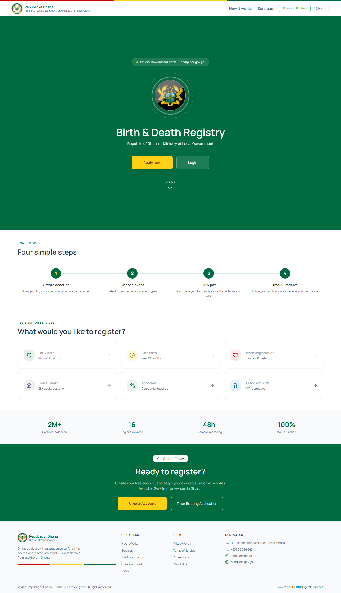

### Section Clips (screens/sections/)

*Clipped individual sections and components*

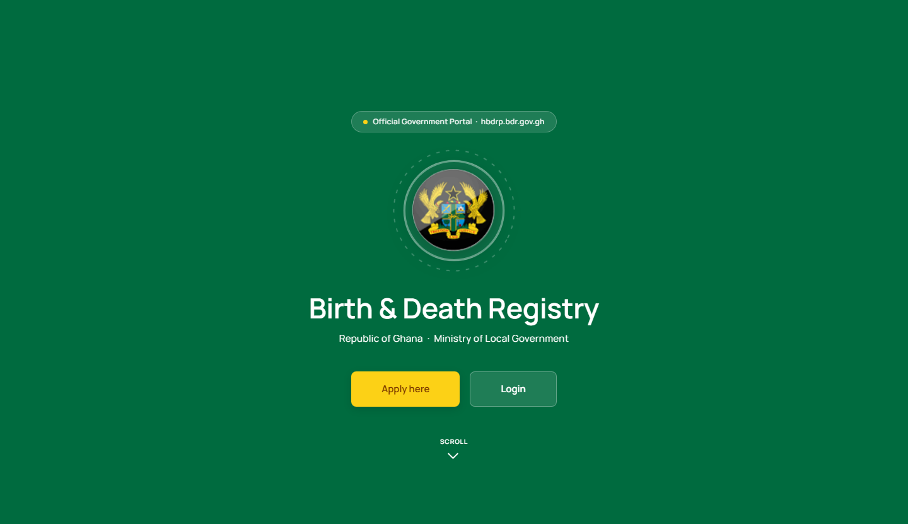

### Interaction States (screens/states/)

*Hover, focus, and active state captures*


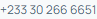

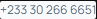

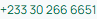


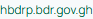

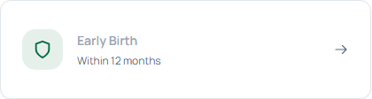


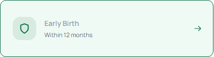

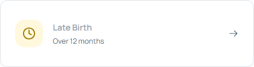


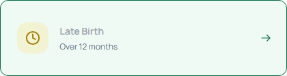

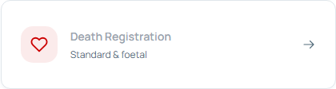


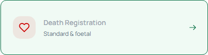

### Screenshot Index (screens/INDEX.md)

# Screenshot Index

## Scroll Journey

> Shows the cinematic state at each point of the page

| Scroll | Y Position | File |
|--------|-----------|------|
| 0% | 0px | `screens/scroll/scroll-000.png` |
| 17% | 272px | `screens/scroll/scroll-017.png` |
| 33% | 528px | `screens/scroll/scroll-033.png` |
| 50% | 801px | `screens/scroll/scroll-050.png` |
| 67% | 1073px | `screens/scroll/scroll-067.png` |
| 83% | 1329px | `screens/scroll/scroll-083.png` |
| 100% | 1601px | `screens/scroll/scroll-100.png` |

## Pages

| Page | URL | File |
|------|-----|------|
| BDR - MatDash Vue | `https://bdr.npontutechnologies.com` | `screens/pages/home.png` |

## Sections

| Page | Section | File |
|------|---------|------|
| home | #1 (section) | `screens/sections/home-section-1.png` |

## Homepage Screenshots (screenshots/)


